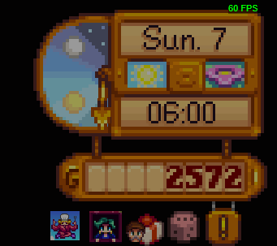
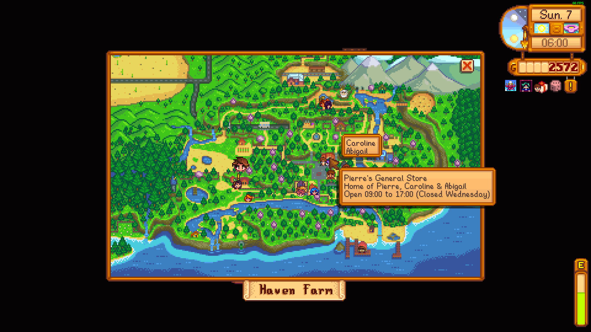
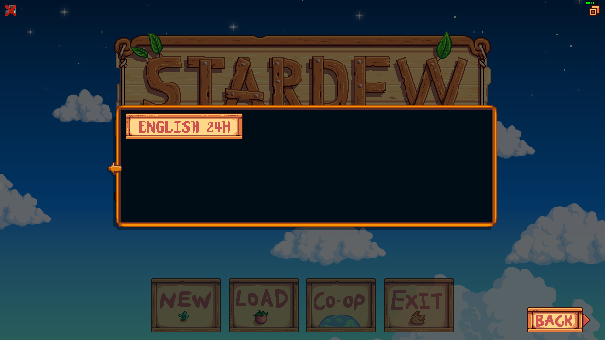
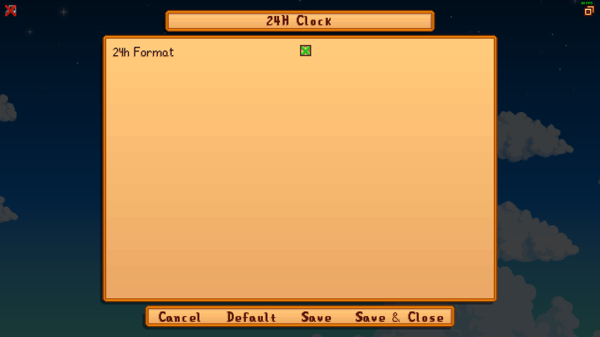

### Mod name
24H Clock for Stardew Valley 1.6+

### Brief overview
Displays the clock and time references in 24H format.

### Detailed description
Tested with Stardew Valley 1.6.3  
This content pack for [Content Patcher](https://www.nexusmods.com/stardewvalley/mods/1915) allows you to displays the clock and time references in 24H format.  
Requires [SMAPI](https://github.com/Pathoschild/SMAPI).  
You must select the additional language `ENGLISH 24H` using the arrow on the right of the language menu.  
You can configure this mod with [Generic Mod Config Menu](https://www.nexusmods.com/stardewvalley/mods/5098).  
Restart the game after you've made any changes.

### Screenshots

